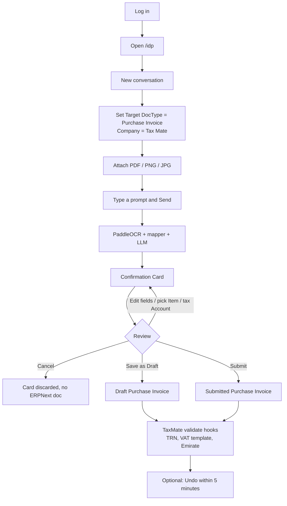

# IDP on TaxMate — complete workflow

**App:** [Intelligent Document Processing (IDP)](https://github.com/sanjay-kumar001/idp)
**Installed on:** `taxmate.site` (16 Sep 2026)
**Site stack:** Frappe 16.18.2 · ERPNext 16.33.0 · TaxMate `feat/uae-e-invoicing`
**IDP version:** `1.0.0` (`main`)

IDP is the OCR / document-extraction app chosen for TaxMate. It is a Frappe v16 + Python 3.14 app. You upload a PDF or image, it extracts structured fields, you confirm a card, and it can draft an ERPNext document (usually a Purchase Invoice).

This document is the operator workflow for **this site**, not a generic IDP README. Paths, defaults, and TaxMate caveats below were read from the installed app and from live `IDP Settings` on `taxmate.site`.

---

## 1. What is installed right now

Verified with `bench --site taxmate.site list-apps`:

| App | Version |
| --- | --- |
| frappe | 16.18.2 |
| erpnext | 16.33.0 |
| taxmate | 0.1.0.0 |
| **idp** | **1.0.0** |
| hrms, payments, jarvis, ascra_theme_2 | already present |

Python packages in the bench env: `paddleocr 3.7.0`, `openai`, `anthropic`, `pypdf`.

Frontend SPA was built during `bench get-app` and is served at `/idp`.

### Live IDP Settings (as of install)

| Setting | Value | Meaning |
| --- | --- | --- |
| Enabled | `1` | Module is on |
| LLM Provider | `openai` | Must add an API key before chat extraction works |
| LLM API Key | empty | **Not configured yet** |
| LLM Model | empty | Falls back to chat defaults |
| LLM Enabled | `1` | Agent uses an LLM, not rules-only |
| LLM Model Routes | none | Optional two-tier routing not set |
| Enable Write Operations | `0` | Intended dry-run flag (see §8) |
| Auto-create Missing Masters | `0` | Will not invent Supplier / Item unless you confirm New rows |
| Default OCR Language | `auto` | Detects English / Arabic / others per file |
| Default Output Language | English | Confirmation cards in English |
| OCR Engine | `auto` | PaddleOCR, then Ollama vision if OCR fails |
| Confidence Threshold | `0.70` | Below this, fields are review-flagged |
| Enable Pre-Validation | `1` | Schema checks before create |
| Enable Hybrid Mapper | `0` | Rule mapper only unless you turn this on |
| Max File Size | 25 MB | Upload cap |
| Max Pages per PDF | 100 | OCR stops after this |
| Undo Window | 5 minutes | After Save as Draft / Submit |
| Active Retention | 90 days | Conversations then auto-archive |
| Company on site | **Tax Mate** (United Arab Emirates) | Default company for created docs |

Seeded fixtures:

- Skills: `Bill of Lading Fields`, `VAT Tax Rounding`
- Prompt templates: `Generic Document Extraction`, `Sales Invoice Extraction`, `Purchase Invoice Extraction`
- Plugin: `core` enabled
- Role: `IDP User` created

---

## 2. Before you process a real invoice

Chat extraction **will fail** until an LLM is configured. Do this once as Administrator / System Manager.

### 2.1 Open settings

Desk: Awesome Bar → **IDP Settings**, or `/app/idp-settings`.

### 2.2 Pick a provider

Choose one:

| Provider | When to use | Extra fields |
| --- | --- | --- |
| **openai** | Fastest to try | Paste **LLM API Key**, set **LLM Model** e.g. `gpt-4o-mini` |
| **anthropic** | Strong extraction | Paste key, model e.g. `claude-haiku-4-5-20251001` |
| **ollama** | Keep invoice images on this machine (matches TaxMate “Prefer UAE-hosted File storage”) | **Ollama Host URL** default `http://localhost:11434`, pull a chat model and optionally a vision model (`minicpm-v` / `llava`) |

Save.

Optional but recommended for production: fill **LLM Model Routes** (one row per purpose: `classification`, `extraction`, `vision`, `summarisation`, `confirmation`). Cheap models for classification; a stronger model for extraction.

### 2.3 TaxMate-safe rollout

Leave these as they are until extraction quality is proven on UAE bills:

1. **Enable Write Operations** = off
2. **Auto-create Missing Masters** = off
3. Create suppliers / items in ERPNext first (with 15-digit TRN)
4. On the Confirmation Card, pick **existing** Item / Account rows; do not Submit until VAT templates look right
5. Prefer **Save as Draft**, then open the Purchase Invoice in Desk and let TaxMate validate

### 2.4 Grant access

| Who | What they need |
| --- | --- |
| Administrator / System Manager | Already allowed |
| Accounts users | Role **IDP User** on the User form, plus ERPNext permission to create Purchase Invoice (draft) |

The SPA at `/idp` is blocked for Guest. `has_app_permission` allows only `IDP User`, `System Manager`, and `Administrator`.

---

## 3. Where to work

| Surface | URL | Use |
| --- | --- | --- |
| **IDP Chat (primary)** | `/idp` → redirects to `/idp/chat` | Upload, extract, confirm |
| Open a conversation | `/idp/chat/<conversation_id>` | Resume a thread |
| IDP workspace | `/app/idp` | Number cards, shortcuts, logs |
| IDP Settings | `/app/idp-settings` | Admin config |
| Conversations list | `/app/idp-conversation` | Audit transcripts |
| Document log | `/app/idp-document-log` | Extraction history |
| Batch jobs | `/app/idp-batch-job` | Many files at once |
| Extraction templates | `/app/idp-extraction-template` | Per-supplier keyword maps |

On this bench the web server port is **8001**, so locally:

`http://taxmate.site:8001/idp`

---

## 4. End-to-end user workflow (Purchase Invoice)

This is the path TaxMate actually needs: **supplier PDF / scan → draft Purchase Invoice**.

Do **not** OCR outbound Sales Invoices (TaxMate already generates those). Do **not** OCR Corner-4 e-invoices (`UAE Incoming Invoice`) — those already have structured PINT-AE JSON.



### Step 1 — New conversation

1. Open `/idp`.
2. Start **New conversation**.
3. Fill:
   - **Target DocType:** `Purchase Invoice` (chat default if you leave it blank)
   - **Company:** `Tax Mate`
   - **OCR language:** `auto` (or `ar` for Arabic-only scans, `en` for English-only)
   - **Output language:** `English`
4. Create.

This creates an `IDP Conversation` named like `IDPCONV-2026-00001`, owned by you.

### Step 2 — Attach the file

In the composer:

- Click the paperclip, **or**
- Drag and drop onto the input box

Accepted types (private File records, not public):

| Kind | Extensions |
| --- | --- |
| PDF | `.pdf` |
| Images | `.png` `.jpg` `.jpeg` `.webp` `.tiff` `.tif` |
| Spreadsheets | `.xlsx` `.xls` `.csv` |
| Word | `.docx` |

Limits: **25 MB**, empty files rejected, max **100 pages**.

The upload API (`idp.api.upload.upload_document`) stores a **private** Frappe File and returns `file_url` like `/private/files/invoice.pdf`. That stays on this site.

### Step 3 — Prompt and Send

Examples that match the agent tools:

- `Extract this invoice into a Purchase Invoice for Tax Mate.`
- `Create a draft Purchase Invoice from this bill.`
- `Compare this bill against PO PUR-ORD-….`
- `Reconcile this bank statement against payments for May.`

Send (Enter, or the Send button). The UI calls `idp.api.conversation.run_agent`.

### Step 4 — What the server does

One agent run (max 12 tool iterations):

1. Persist your message on `IDP Message`.
2. Resolve attachments (file aliases `file_1`, `file_2`, …).
3. If the PDF has a text layer long enough (`vision_text_threshold` = 200 chars), use **pypdf**. If it is a scan / image, run **PaddleOCR** (language `auto`). On OCR error, optionally fall back to **Ollama vision**.
4. LLM tools typically:
   - `extract_document` — OCR + FieldMapper
   - `validate_document` — schema / business rules
   - `resolve_masters` — match Supplier / Item
   - `propose_create_document` — render the Confirmation Card
5. Stream tokens over Socket.IO. A cost/tokens footer shows at the bottom.

Rule-mapper keywords for Purchase Invoice include supplier, invoice date, due date, bill no, VAT/GST, subtotal, grand total. They are **generic / Indian-GST flavoured**, not UAE TRN / 5% VAT templates. Expect to correct tax rows by hand.

### Step 5 — Confirmation Card

The card is an editable form in the chat:

| Block | What you check for TaxMate |
| --- | --- |
| Header | Supplier (must already exist with 15-digit TRN), posting date, bill no, currency AED, company Tax Mate |
| Items | Qty, rate, amount. Prefer **EXISTING** Item from the dropdown. **NEW** will try to auto-create an Item if you proceed with masters on |
| Taxes | Each tax row **must** map to a real Account (UAE VAT 5% input account). Unmapped accounts block create with a friendly error |
| Totals | Subtotal + tax ≈ grand total |
| Actions | **Submit** · **Save as Draft** · **Edit** · **Cancel** |

Confidence dots (green / amber / red) are off until you tick **Show Confidence Dots** in IDP Settings.

### Step 6 — Save as Draft (recommended)

Click **Save as Draft**.

`confirm_card` then:

1. Re-validates edited values
2. Blocks if tax Account Heads do not exist
3. Builds a `MappedDocument` and inserts a **Draft** Purchase Invoice
4. Attaches the original PDF/image to that invoice
5. Posts an acknowledgement in chat with a Desk link
6. Starts a **5-minute undo** window

Then open the Purchase Invoice in Desk. TaxMate `validate` hooks run on save/submit there:

- Supplier TRN (15 digits)
- UAE VAT tax templates / recoverable VAT (Box 9)
- Emirate on address
- Designated zone / reverse charge where relevant
- E-invoice readiness for self-billed PIs

If those fail, fix the draft in Desk. Do not Submit from the chat until a few bills have gone through cleanly.

### Step 7 — Undo

On the card, **Undo** (within 5 minutes):

- Draft → deleted
- Submitted → cancelled (if ERPNext allows)

Originating user or System Manager only. After the window, use normal Desk cancel/amend.

---

## 5. Other document types IDP can target

Hard-coded in `idp.core.constants.SUPPORTED_DOCTYPES`:

- Purchase Invoice *(TaxMate primary)*
- Sales Invoice *(only for inbound paper copies you did not issue)*
- Quotation, Sales Order, Supplier Quotation, Purchase Order
- Delivery Note, Purchase Receipt
- Payment Entry, Journal Entry
- Opportunity

Bank statements use a specialised extractor (`idp.extractors.bank_statement`) and can be reconciled against Payment Entry / Journal Entry from chat.

Custom TaxMate DocTypes (`UAE Customs Declaration`, `UAE Incoming Invoice`, etc.) are **not** in that list. To extract customs bills into `UAE Customs Declaration` you would add an **IDP Extraction Template** plus (later) a TaxMate IDP plugin. Out of the box, treat customs PDFs as attachments on a Purchase Invoice / Landed Cost Voucher, then fill the customs DocType by hand.

---

## 6. Batch workflow (many files)

1. Desk → **IDP Batch Job** or chat batch UI
2. Create a job with Target DocType + file URLs (or a ZIP via `create_batch_from_zip`)
3. Worker runs extract → map → create per file
4. Status per row: Success / Failed / Needs Review
5. Review `IDP Document Log` and any draft invoices

Do not batch-Submit on TaxMate until single-file drafts are trusted.

---

## 7. Admin / quality loop

| DocType | Role |
| --- | --- |
| **IDP Extraction Template** | Per-supplier keyword map. Example: `"Tax No."` → `tax_id`, `"TRN"` → supplier tax id. Use this for repeating UAE vendor layouts. |
| **IDP Extraction Correction** | Corrections become few-shot examples for later LLM turns. |
| **IDP Skill** | Markdown rules appended to the prompt (shipped: VAT rounding, bill of lading). Add a UAE VAT skill here if you want the model to prefer 5% / zero / exempt templates. |
| **IDP Prompt Template** | System prompts for PI / SI / generic. |
| **IDP Tool Configuration** | Enable/disable tools, role gates, confirmation required. |
| **IDP Plugin Configuration** | `core` is on. TaxMate can later register `idp_plugins` in its `hooks.py`. |
| **IDP Tool Call Log** | Every tool call for audit. |
| Daily scheduler | Archives conversations older than 90 days. |
| Weekly scheduler | Fine-tune export + token-efficiency regression email. |

---

## 8. How this interacts with TaxMate (read this)

### Useful

| TaxMate work | IDP |
| --- | --- |
| Paper / PDF supplier bills (not yet on Peppol) | High — this is the gap |
| Expense receipts / image bills | Medium |
| Bank statement PDF | Medium |
| Trade licence / TRN certificate (onboarding) | Medium — extract then type into Supplier/Company |

### Not useful / already covered

| TaxMate work | Why skip OCR |
| --- | --- |
| Outbound Sales Invoice / e-invoice XML | TaxMate generates PINT-AE |
| `UAE Incoming Invoice` (Corner-4) | Already structured JSON from the ASP |
| VAT 201 boxes | Computed from the ledger, not from a scan |
| UBO / ESR / CT filing logs | Trackers, not scanned forms |

### Risks on this site

1. **Generic tax mapping.** IDP aliases `vat` / `gst` to taxes. It will not pick TaxMate Item Tax Templates (`uae_vat_category` Standard / Zero / Exempt) by itself.
2. **TRN.** FieldMapper looks for GSTIN-style labels, not a 15-digit UAE TRN. Match the Supplier by name, then TaxMate validates TRN on the PI.
3. **Submit from chat** calls ERPNext `submit()`. That fires TaxMate `before_submit` / `on_submit` (e-invoice, VAT). A bad OCR PI can fail loudly or, worse, submit with the wrong tax account.
4. **`Enable Write Operations = 0` is not a hard backend lock.** The setting is exposed to the SPA as `features.write_operations`, but `confirm_card` still inserts the ERPNext document if you click Save as Draft / Submit. Treat those buttons as live. Cancel is the safe exit.
5. **Cloud LLMs send extracted text (and sometimes page images) off-site.** TaxMate Settings prefers UAE-hosted files. For production, use **Ollama** on the same region, or accept that OpenAI/Anthropic see bill contents.
6. **Do not auto-create Items** until you have a UAE item tax template on every new item.

---

## 9. Agent tools (what the model can do)

LLM-exposed (from `idp/tools/__init__.py`):

| Tool | Mutating? | Purpose |
| --- | --- | --- |
| `extract_document` | no | OCR + map |
| `validate_document` | no | Schema / rules |
| `resolve_masters` | no / create if allowed | Supplier, Customer, Item |
| `search_documents` | no | Find existing PI / PO / party |
| `compare_document` | no | Diff vs PO / SO |
| `propose_create_document` | no | Confirmation Card only |
| `create_document` | **yes** | Insert after user confirms |
| `update_document` | **yes** | Edit existing (amend if submitted) |
| `delete_document` | **yes** | Delete draft / cancel submitted |
| `ask_user` | no | Clarifying question |

`create_document` refuses unless `user_confirmed=True` (injected after the card, not invented by the model).

---

## 10. Troubleshooting

| Symptom | Cause | Fix |
| --- | --- | --- |
| Chat error about the AI service / connection | No LLM key, or Ollama down | IDP Settings → paste key or start Ollama |
| *IDP disabled* | `Enabled` off | Tick Enabled |
| OCR slow / first image hangs | PaddleOCR downloading models | Wait; subsequent runs reuse the singleton engine (timeout 300s) |
| Arabic garbled | Language pinned to `en` | Conversation OCR language `auto` or `ar` |
| Tax account error on Save as Draft | Tax row not linked to Chart of Accounts | Pick the UAE VAT input account in the card |
| PI validate: invalid TRN | Supplier has no 15-digit TRN | Fix Supplier, then re-save the draft in Desk |
| PI validate: missing Emirate / tax template | OCR did not set TaxMate fields | Set them on the draft in Desk |
| File type rejected | Unsupported MIME | Export to PDF / PNG |
| File too large | > 25 MB | Compress or split |
| Duplicate bill | Same supplier + bill_no | IDP comparison / ERPNext duplicate bill check |
| Cannot open `/idp` | Guest, or missing role | Log in; add **IDP User** |

---

## 11. Commands used to install (this bench)

```bash
cd /home/ascra/Desktop/frappe-bench
bench get-app https://github.com/sanjay-kumar001/idp
bench --site taxmate.site install-app idp
```

`get-app` already ran `yarn` in `apps/idp/frontend` and `vite build`. Re-build after IDP upgrades:

```bash
bench build --app idp
bench --site taxmate.site migrate
bench restart
```

Uninstall (only if you are sure):

```bash
bench --site taxmate.site uninstall-app idp
```

That does not remove historical Purchase Invoices IDP created.

---

## 12. First bill checklist

1. [ ] LLM API key **or** Ollama running
2. [ ] User has **IDP User** (or is System Manager)
3. [ ] Supplier exists with 15-digit TRN and UAE address (Emirate)
4. [ ] UAE VAT tax accounts exist on company **Tax Mate**
5. [ ] Open `/idp` → new conversation → Purchase Invoice → Tax Mate
6. [ ] Upload one English or bilingual supplier PDF
7. [ ] Confirm card → **Save as Draft** (not Submit)
8. [ ] Open the draft PI in Desk → confirm tax template, TRN, totals
9. [ ] Submit from Desk once TaxMate validation passes
10. [ ] Only then consider turning on hybrid mapper / write-ops / batch
